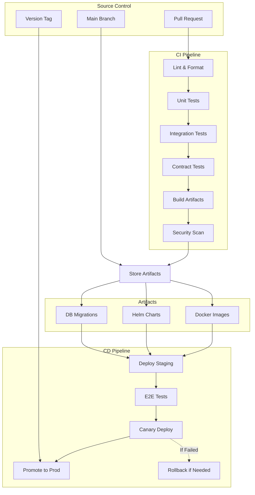
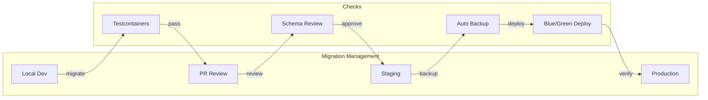
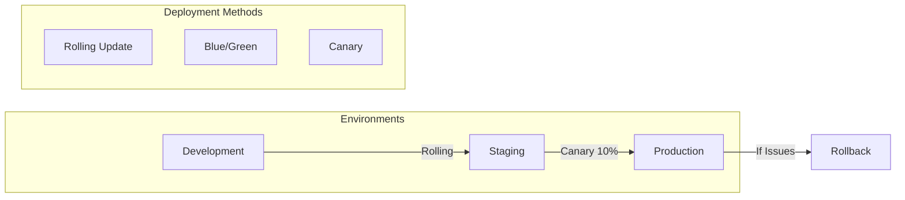
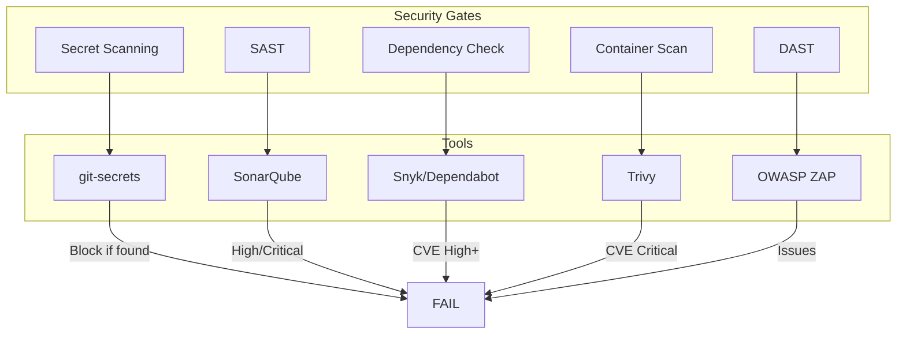

# CI/CD & Development Plan

**Version**: 1.0.0  
**Status**: Draft  
**Last Updated**: 2026-04-13  
**Owner**: DevOps & Engineering Teams  

---

## 1. Development Philosophy

### Principles

1. **Trunk-Based Development**: Short-lived branches, frequent integration
2. **Immutable Artifacts**: Build once, deploy everywhere
3. **Automated Testing**: Unit → Integration → Contract → E2E
4. **GitOps**: Git as single source of truth for infrastructure
5. **Progressive Delivery**: Canary → Blue/Green → Full rollout

---

## 2. Repository Structure

```
openai-ussd-kernel/
├── .github/
│   └── workflows/          # GitHub Actions CI/CD
├── protos/                 # Shared gRPC contracts
│   ├── ussd_gateway.proto
│   ├── orchestrator.proto
│   ├── payment.proto
│   └── session.proto
├── python-gateway/         # Python USSD Gateway
│   ├── src/
│   ├── tests/
│   ├── Dockerfile
│   └── pyproject.toml
├── go-orchestrator/        # Go Orchestrator
│   ├── cmd/
│   ├── internal/
│   ├── tests/
│   ├── Dockerfile
│   └── go.mod
├── rust-engine/            # Rust Engine (workspace)
│   ├── session-reconstructor/
│   ├── payment-engine/
│   ├── merkle-audit/
│   ├── Cargo.toml
│   └── Dockerfile
├── sdk/
│   └── python/             # Tenant SDK
├── infra/
│   ├── terraform/          # Infrastructure as Code
│   ├── kubernetes/         # K8s manifests
│   └── helm/               # Helm charts
├── migrations/             # Database migrations (V001-V073)
├── docs/                   # Documentation
└── Makefile                # Common tasks
```

---

## 3. CI/CD Pipeline Architecture



---

## 4. Language-Specific CI Configuration

### 4.1 Python (Gateway & AI)

```yaml
# .github/workflows/python-ci.yaml
name: Python CI

on:
  push:
    paths:
      - 'python-gateway/**'
      - 'protos/**'
      - '.github/workflows/python-ci.yaml'

jobs:
  lint:
    runs-on: ubuntu-latest
    steps:
      - uses: actions/checkout@v4
      - uses: actions/setup-python@v5
        with:
          python-version: '3.12'
      - run: pip install ruff mypy black
      - run: ruff check python-gateway/src
      - run: black --check python-gateway/src
      - run: mypy python-gateway/src

  test:
    runs-on: ubuntu-latest
    services:
      postgres:
        image: timescale/timescaledb:latest-pg16
        env:
          POSTGRES_PASSWORD: test
    steps:
      - uses: actions/checkout@v4
      - uses: actions/setup-python@v5
        with:
          python-version: '3.12'
      - run: pip install pytest pytest-asyncio pytest-cov
      - run: pytest python-gateway/tests --cov=src --cov-report=xml
      - uses: codecov/codecov-action@v3
        with:
          files: ./coverage.xml

  security:
    runs-on: ubuntu-latest
    steps:
      - uses: actions/checkout@v4
      - uses: pypa/gh-action-pip-audit@v1
        with:
          inputs: python-gateway/requirements.txt
      - run: |
          pip install bandit
          bandit -r python-gateway/src -f json -o bandit-report.json

  build:
    needs: [lint, test, security]
    runs-on: ubuntu-latest
    steps:
      - uses: actions/checkout@v4
      - uses: docker/build-push-action@v5
        with:
          context: ./python-gateway
          push: ${{ github.ref == 'refs/heads/main' }}
          tags: |
            ghcr.io/${{ github.repository }}/python-gateway:${{ github.sha }}
            ghcr.io/${{ github.repository }}/python-gateway:latest
```

### 4.2 Go (Orchestrator)

```yaml
# .github/workflows/go-ci.yaml
name: Go CI

on:
  push:
    paths:
      - 'go-orchestrator/**'
      - 'protos/**'
      - '.github/workflows/go-ci.yaml'

jobs:
  lint:
    runs-on: ubuntu-latest
    steps:
      - uses: actions/checkout@v4
      - uses: actions/setup-go@v5
        with:
          go-version: '1.22'
      - uses: golangci/golangci-lint-action@v3
        with:
          version: latest
          working-directory: go-orchestrator
          args: --enable=gosec,staticcheck,ineffassign

  test:
    runs-on: ubuntu-latest
    services:
      postgres:
        image: timescale/timescaledb:latest-pg16
        env:
          POSTGRES_PASSWORD: test
      redis:
        image: redis:7
    steps:
      - uses: actions/checkout@v4
      - uses: actions/setup-go@v5
        with:
          go-version: '1.22'
      - run: go test -race -coverprofile=coverage.out ./...
        working-directory: go-orchestrator
      - run: go tool cover -html=coverage.out -o coverage.html
        working-directory: go-orchestrator

  integration:
    runs-on: ubuntu-latest
    steps:
      - uses: actions/checkout@v4
      - name: Run integration tests with testcontainers
        run: |
          cd go-orchestrator
          go test -tags=integration ./tests/integration/...

  build:
    needs: [lint, test, integration]
    runs-on: ubuntu-latest
    steps:
      - uses: actions/checkout@v4
      - uses: docker/build-push-action@v5
        with:
          context: ./go-orchestrator
          push: ${{ github.ref == 'refs/heads/main' }}
          tags: |
            ghcr.io/${{ github.repository }}/go-orchestrator:${{ github.sha }}
            ghcr.io/${{ github.repository }}/go-orchestrator:latest
```

### 4.3 Rust (Engine)

```yaml
# .github/workflows/rust-ci.yaml
name: Rust CI

on:
  push:
    paths:
      - 'rust-engine/**'
      - 'protos/**'
      - '.github/workflows/rust-ci.yaml'

jobs:
  lint:
    runs-on: ubuntu-latest
    steps:
      - uses: actions/checkout@v4
      - uses: dtolnay/rust-action@stable
      - run: rustup component add clippy rustfmt
      - run: cargo fmt --check
        working-directory: rust-engine
      - run: cargo clippy --all-targets -- -D warnings
        working-directory: rust-engine

  test:
    runs-on: ubuntu-latest
    services:
      postgres:
        image: timescale/timescaledb:latest-pg16
        env:
          POSTGRES_PASSWORD: test
    steps:
      - uses: actions/checkout@v4
      - uses: dtolnay/rust-action@stable
      - run: cargo test --workspace
        working-directory: rust-engine
      - run: cargo test --workspace --release
        working-directory: rust-engine

  security:
    runs-on: ubuntu-latest
    steps:
      - uses: actions/checkout@v4
      - uses: rustsec/audit-check@v1
        with:
          token: ${{ secrets.GITHUB_TOKEN }}

  build:
    needs: [lint, test, security]
    runs-on: ubuntu-latest
    steps:
      - uses: actions/checkout@v4
      - uses: docker/build-push-action@v5
        with:
          context: ./rust-engine
          push: ${{ github.ref == 'refs/heads/main' }}
          tags: |
            ghcr.io/${{ github.repository }}/rust-engine:${{ github.sha }}
            ghcr.io/${{ github.repository }}/rust-engine:latest
```

---

## 5. Database Migration Strategy

### Migration Pipeline



### Migration Rules

1. **Forward Only**: No rollback migrations; fix forward
2. **Idempotent**: Use `IF NOT EXISTS`
3. **Tested**: Migrations run against ephemeral database in CI
4. **Reviewed**: All migrations require DBA review
5. **Timed**: Migrations must complete in < 5 minutes

### Migration Template

```sql
-- =============================================================================
-- Migration: V074__feature_description
-- Description: Brief description of changes
-- Dependencies: V073
-- Estimated Time: 30 seconds
-- Risk Level: Low
-- =============================================================================

SET statement_timeout = 0;
SET lock_timeout = 0;
SET client_encoding = 'UTF8';
SET check_function_bodies = false;

BEGIN;

-- Changes here

COMMIT;
```

---

## 6. Testing Strategy

### Test Pyramid

```
        /\
       /  \
      / E2E \         <- Few tests, slow, expensive
     /--------\
    / Contract \      <- Medium tests, verify contracts
   /------------\
  / Integration  \    <- More tests, with real dependencies
 /----------------\
/     Unit        \   <- Many tests, fast, isolated
---------------------
```

### Test Configuration

| Test Type | Framework | Coverage Target | Execution Time |
|-----------|-----------|-----------------|----------------|
| **Unit** | pytest (Py), gotest (Go), cargo test (Rust) | 80% | < 2 min |
| **Integration** | testcontainers-go, pytest-docker | 60% | < 5 min |
| **Contract** | Pact | 100% contracts | < 3 min |
| **E2E** | Cucumber, Playwright | Critical paths | < 10 min |
| **Chaos** | Chaos Mesh | Resilience tests | Scheduled |

### Contract Testing Example

```python
# Python Gateway contract test
import pytest
from pact import Consumer, Provider

@pytest.fixture
def pact():
    return Consumer('python-gateway').has_pact_with(
        Provider('go-orchestrator'),
        pact_dir='./pacts'
    )

def test_forward_ussd_request(pact):
    expected = {
        'session_id': 'test-session-123',
        'phone_number': '+263712345678',
        'user_input': '1',
        'tenant_id': 'test-tenant'
    }
    
    (pact
     .given('orchestrator is running')
     .upon_receiving('a USSD request')
     .with_request('POST', '/v1/ussd/forward', body=expected)
     .will_respond_with(200, body={
         'menu_text': 'Welcome',
         'session_status': 'CONTINUE'
     }))
    
    with pact:
        result = gateway.forward_ussd(expected)
        assert result['session_status'] == 'CONTINUE'
```

---

## 7. Deployment Strategy

### Environment Progression



### Canary Deployment

```yaml
# canary-deployment.yaml
apiVersion: flagger.app/v1beta1
kind: Canary
metadata:
  name: go-orchestrator
spec:
  targetRef:
    apiVersion: apps/v1
    kind: Deployment
    name: go-orchestrator
  service:
    port: 8080
  analysis:
    interval: 30s
    threshold: 5
    maxWeight: 50
    stepWeight: 10
    metrics:
      - name: request-success-rate
        thresholdRange:
          min: 99
      - name: request-duration
        thresholdRange:
          max: 500
    webhooks:
      - name: load-test
        url: http://flagger-loadtester.test/
        timeout: 5s
        metadata:
          cmd: "hey -z 1m -q 10 -c 2 http://go-orchestrator:8080/health"
```

---

## 8. Security in CI/CD

### Security Pipeline



### Security Scan Configuration

```yaml
# Container scan with Trivy
- name: Scan Docker image
  uses: aquasecurity/trivy-action@master
  with:
    image-ref: 'ghcr.io/${{ github.repository }}/go-orchestrator:${{ github.sha }}'
    format: 'sarif'
    output: 'trivy-results.sarif'
    severity: 'CRITICAL,HIGH'
    exit-code: '1'
```

---

## 9. Observability Integration

### Metrics Collection

```yaml
# Prometheus ServiceMonitor
apiVersion: monitoring.coreos.com/v1
kind: ServiceMonitor
metadata:
  name: ussd-kernel-metrics
spec:
  selector:
    matchLabels:
      app: ussd-kernel
  endpoints:
    - port: metrics
      path: /metrics
      interval: 15s
```

### Tracing Configuration

```python
# Python OpenTelemetry setup
from opentelemetry import trace
from opentelemetry.exporter.otlp.proto.grpc.trace_exporter import OTLPSpanExporter
from opentelemetry.sdk.trace import TracerProvider
from opentelemetry.sdk.trace.export import BatchSpanProcessor

provider = TracerProvider()
processor = BatchSpanProcessor(
    OTLPSpanExporter(endpoint="otel-collector:4317")
)
provider.add_span_processor(processor)
trace.set_tracer_provider(provider)
```

---

## 10. Rollback Procedures

### Automated Rollback Triggers

| Condition | Action | Timeframe |
|-----------|--------|-----------|
| Error rate > 5% | Automatic rollback | 2 minutes |
| Latency p99 > 1s | Automatic rollback | 3 minutes |
| Health check fails | Automatic rollback | 1 minute |
| Manual trigger | Operator-initiated | Immediate |

### Rollback Commands

```bash
# Rollback to previous version
kubectl rollout undo deployment/go-orchestrator

# Rollback to specific revision
kubectl rollout undo deployment/go-orchestrator --to-revision=3

# Database rollback (emergency only)
# Note: Forward-only preferred; document manual fix
psql -f emergency-rollback-v073.sql
```

---

## 11. Development Workflow

### Branch Strategy

```
main (protected)
  ↑
  │ feature/session-timeout
  │   ↑
  │   │ dev/session-timeout-tests
  │   └─ PR → Code Review → Merge
  │
  │ feature/payment-retry
  └─ ...
```

### Commit Convention

```
type(scope): subject

body (optional)

footer (optional)
```

Types: `feat`, `fix`, `docs`, `style`, `refactor`, `test`, `chore`, `security`

Examples:
- `feat(session): add multi-layer timeout support`
- `fix(payment): handle EcoCash timeout gracefully`
- `security(ledger): add row-level security policies`

---

## 12. Definition of Done

### For Features

- [ ] Code complete and follows style guide
- [ ] Unit tests passing (>80% coverage)
- [ ] Integration tests passing
- [ ] Contract tests updated
- [ ] Documentation updated
- [ ] Security scan passed
- [ ] Performance benchmarks met
- [ ] Code review approved
- [ ] QA sign-off
- [ ] Feature flag added (if applicable)

### For Releases

- [ ] All features merged
- [ ] E2E tests passing
- [ ] Load testing completed
- [ ] Security audit passed
- [ ] Database migrations tested
- [ ] Rollback plan documented
- [ ] Runbook updated
- [ ] Monitoring dashboards verified
- [ ] On-call briefing completed
