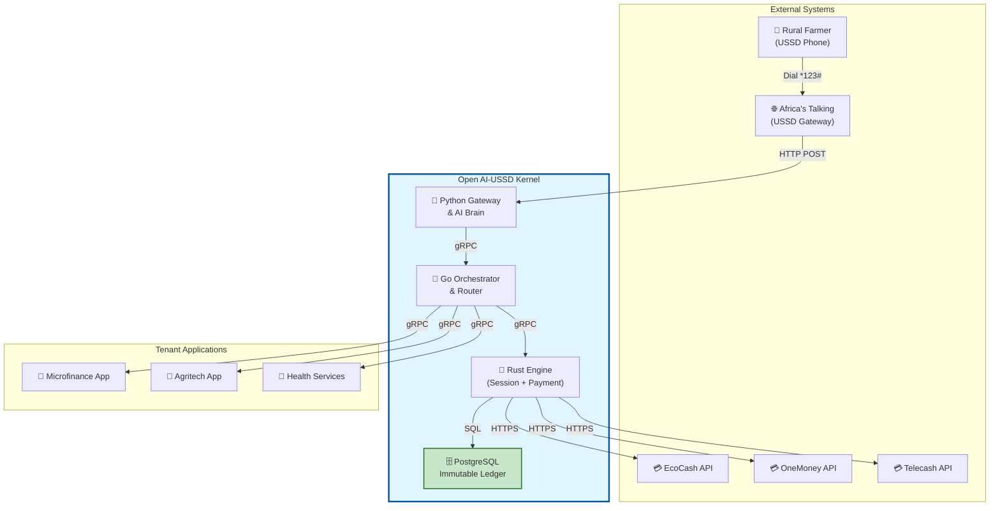
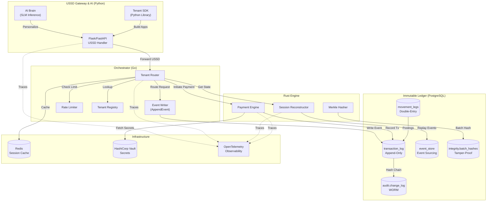
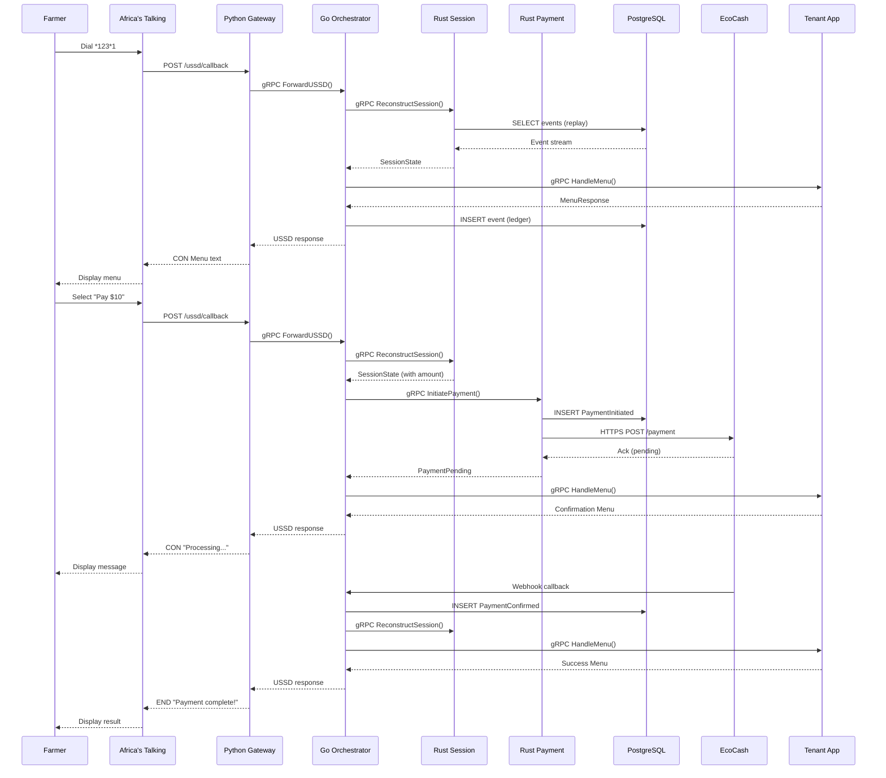
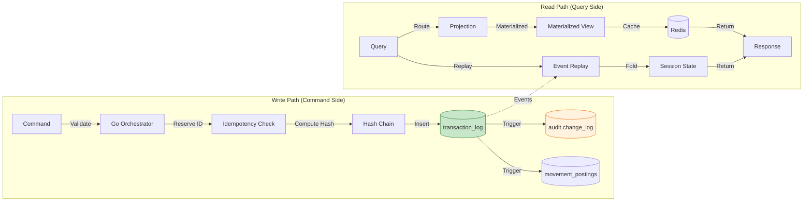
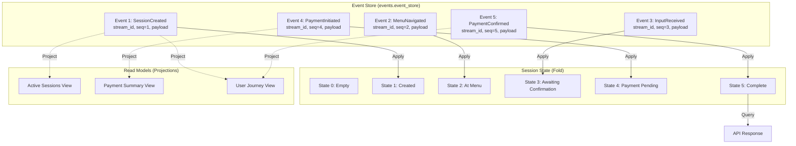
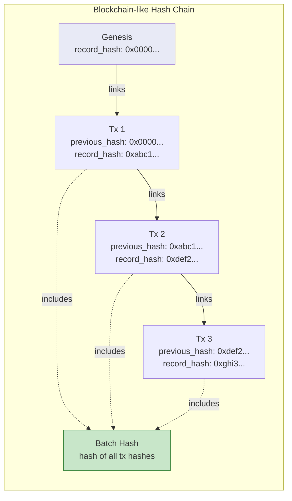
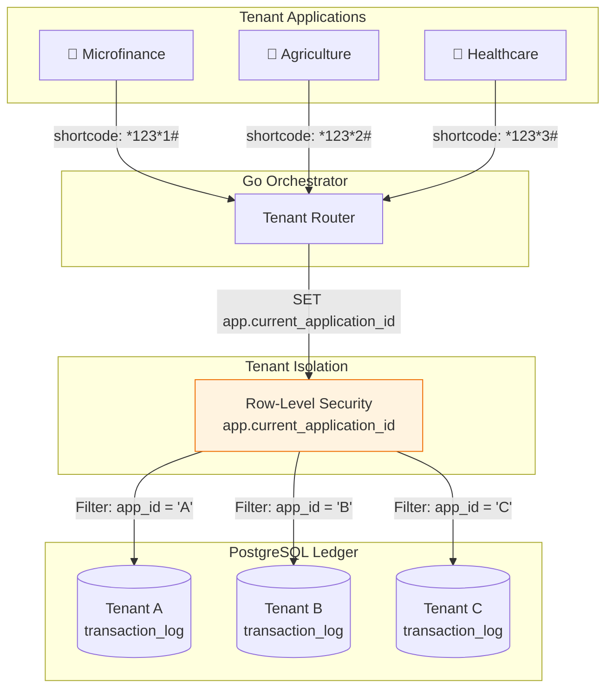
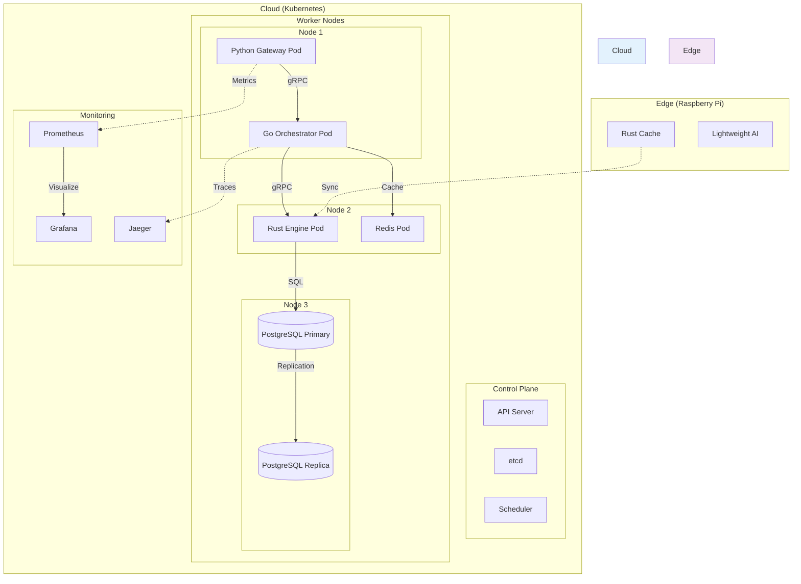
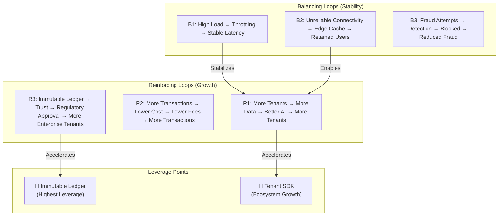
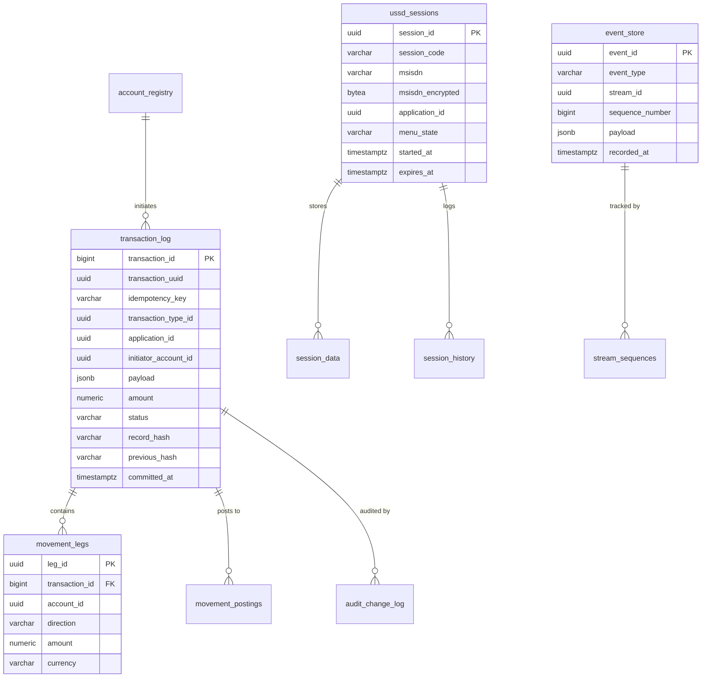

# High-Level System Design

**Version**: 1.0.0  
**Status**: Approved  
**Last Updated**: 2026-04-13  

---

## 1. System Context Diagram (C4 Level 1)

> **Note**: The Open AI-USSD Kernel Engine is a kernel/SDK platform. It provides API endpoints and adapters (including mobile money) to **tenant applications**, which in turn serve end users. The kernel does not directly provide financial services to end users.

---

## 2. Container Diagram (C4 Level 2)

---

## 3. Component Flow: Complete USSD Payment

---

## 4. Data Flow Architecture

---

## 5. Event Sourcing Model

---

## 6. Hash Chain Integrity

---

## 7. Multi-Tenancy Architecture

---

## 8. Deployment Topology

---

## 9. Feedback Loops (Systems Thinking)

---

## 10. Technology Stack

| Layer | Technology | Purpose |
|-------|------------|---------|
| **USSD Gateway** | Python 3.12, Flask/FastAPI | Africa's Talking integration |
| **AI Brain** | Python, PyTorch, Hugging Face | SLM inference, translation |
| **Orchestrator** | Go 1.22 | Routing, concurrency, event writing |
| **Engine** | Rust 1.77 | Session reconstruction, payments |
| **Ledger** | PostgreSQL 16, TimescaleDB | Immutable event store |
| **Cache** | Redis 7 | Session state, rate limiting |
| **Secrets** | HashiCorp Vault | API keys, credentials |
| **Observability** | OpenTelemetry, Grafana, Jaeger | Metrics, traces, logs |
| **Deployment** | Kubernetes, Helm | Container orchestration |
| **Edge** | Raspberry Pi, K3s | Offline capability |

---

## 11. Database Schema Overview

---

## 12. Key Design Decisions

| Decision | Choice | Rationale |
|----------|--------|-----------|
| **Architecture Pattern** | DDD + Hexagonal + CQRS/ES | Domain purity, testability, scalability |
| **Polyglot Stack** | Python/Go/Rust | Each language for its strength |
| **Communication** | gRPC + Protobuf | Performance, type safety |
| **Persistence** | PostgreSQL + TimescaleDB | ACID, time-series, proven technology |
| **Immutability** | Database Triggers | Enforced at DB level, tamper-proof |
| **Caching** | Redis | Speed, session management |
| **Secrets** | Vault CSI | Secure, rotatable, auditable |
| **Observability** | OpenTelemetry | Vendor-neutral, comprehensive |
| **Deployment** | Kubernetes | Scalable, self-healing |
| **Edge** | Raspberry Pi + Rust | Offline capability, low power |
